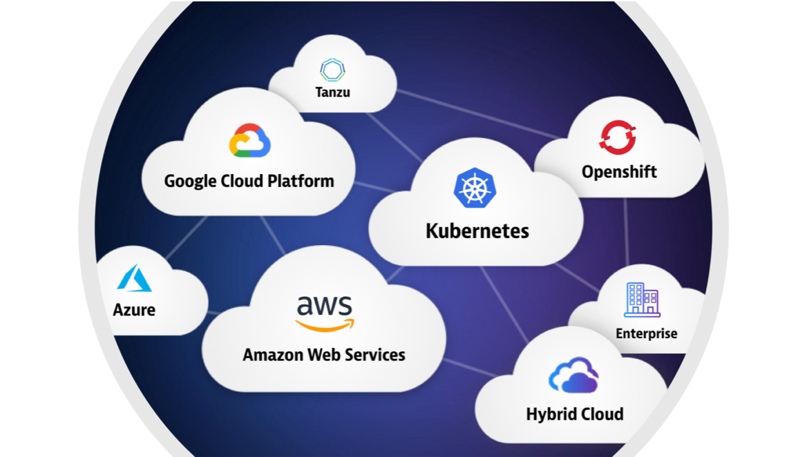

Welcome to the **Cloud Migration Best Practices / Bridging the gap between legacy & cloud** workshop.

In this session, you will learn what it takes to define and execute a migration strategy for a low-risk, smooth transition to the cloud.  Learn Dynatrace's advanced observability features that give you actionable insights every step of the way – from assessing, planning, migrating, and finally – optimization!  

